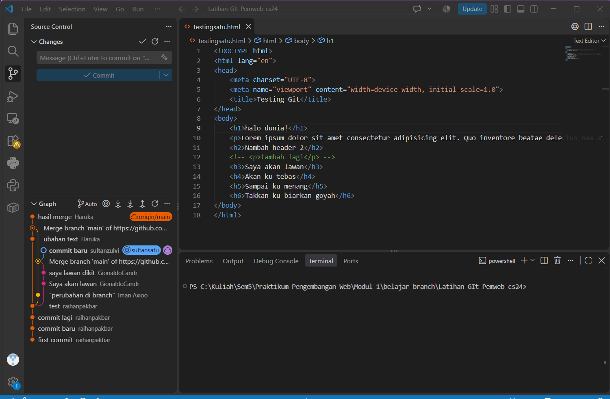
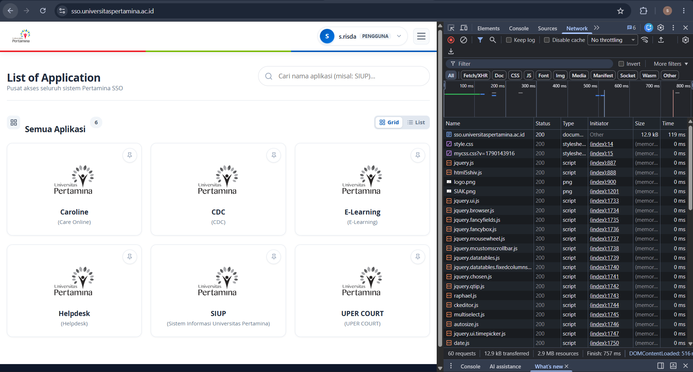

# Dokumen Teknis Modul 1 — Lingkungan Pengembangan, Git, dan Lalu Lintas HTTP

- **Nama**: Sultan Zulvi Risda
- **NIM**: 105224034
- **Repositori**: [Tautan Repositori GitHub Anda]

---

## 1. Lingkungan Pengembangan

Daftar spesifikasi perangkat keras, sistem operasi, serta perangkat lunak yang digunakan selama praktikum:

| Perangkat / Tool | Versi / Spesifikasi | Keterangan |
| :--- | :--- | :--- |
| Sistem Operasi | [Misal: Windows 11 Home 64-bit / macOS Sonoma] | Lingkungan OS utama |
| Node.js | v24.x.x LTS | Runtime JavaScript server-side |
| npm | 11.x.x | Manajer paket Node.js |
| Git | 2.x.x | Sistem kendali versi terdistribusi |
| Visual Studio Code | 1.x.x | Editor kode utama |
| Peramban | Google Chrome / Microsoft Edge (Versi terbaru) | Pengujian & DevTools |

---

## 2. Alur Kerja Git

- **Working Tree, Staging Area, dan Repositori Lokal**: Perubahan berkas dimulai pada *working tree*. Berkas yang akan disimpan ditandai ke *staging area* menggunakan perintah `git add`, lalu dibukukan secara permanen ke *repositori lokal* (`.git`) melalui `git commit`. Salinan riwayat disinkronkan ke *repositori remote* (GitHub) melalui `git push`.
- **Pengamanan Berkas `.env`**: Berkas `.env` dan `.env.local` tidak boleh dicatat dalam commit karena memuat kredensial rahasia (seperti kunci API dan koneksi basis data). Pola `.env*` wajib dimasukkan ke `.gitignore`. Apabila berkas rahasia terlanjur ter-commit, rahasia tersebut harus dianggap bocor dan wajib segera dicabut/diganti (*revoke*), karena riwayat Git tetap menyimpannya meskipun berkas telah dihapus di commit berikutnya.

### 2.1 Bukti Pengujian Alur Git Kolaboratif (Latihan Branch & Remote Push)
---
Sebagai bukti penerapan sistem kendali versi terdistribusi dan simulasi alur kolaborasi:
1. **Kloning Repositori**: Dilakukan `git clone` terhadap repositori latihan asprak (`Latihan-Git-Pemweb-cs24`).
2. **Pembuatan Branch**: Dibuat branch kerja lokal bernama `sultansatu` untuk memisahkan modifikasi dari branch utama.
3. **Modifikasi Berkas**: Berkas `testingsatu.html` dimodifikasi pada bagian elemen heading (`<h3>` hingga `<h6>`) untuk menambahkan baris teks baru.
4. **Staging, Commit, dan Push**:
   - Perubahan ditandai menggunakan `git add testingsatu.html`.
   - Commit dibuat dengan pesan `"commit baru"`.
   - Branch lokal dikirim ke repositori remote melalui perintah `git push origin sultansatu`.
5. **Verifikasi Git Graph**:
   Grafik riwayat commit pada antarmuka VS Code menampilkan cabang independen `sultansatu` yang berhasil bercabang dari commit sebelumnya dan berdampingan dengan kontribusi anggota lain (`raihanpakbar`, `GionaldoCandr`, `Haruka`).

#### Tangkapan Layar Pengujian Git Graph & Kode HTML:

## 3. Alur Kerja Berbasis Branch dan Pull Request (GitHub Flow)

- **Buat Branch** `git switch -c <nama-branch>` agar branch `main` selalu stabil dan siap rilis
- **Commit Perubahan** : Simpan pekerjaan bertahap dengan pesan terstruktur (*Conventional Commits* : `feat:`, `docs:`, `fix:`, `chore:`).
- **Buka Pull Request** (**PR**): Usulan penggabungan branch di GitHub disertai deskripsi perubahan
- **Tinjau dan Uji** : Pemeriksaan kode bersama tim atau kolaborator di antarmuka GitHub.
- **Merge** ke `main`: Penggabungan kode yang sudah lolos uji ke branch `main`.
- **Pull ke Lokal** :   Menyelaraskan repositori lokal (`git switch main → git pull`) lalu menghapus branch fitur lama.

## 4. Keamanan: Berkas `.env` Tidak Boleh Dicatatkan (*Commit*)

- **Alasan**: Berkas lingkungan (`.env`, `.env.local`) berisi kredensial sensitif seperti kata sandi basis data, token autentikasi, dan kunci **API** privat.
- **Aturan Git**: Menambahkan pola `.env*` ke `.gitignore` hanya mencegah berkas yang belum pernah di-commit. Jika rahasia sudah terlanjur di-commit, riwayat commit Git menyimpannya secara permanen.
- **Mitigasi**: Rahasia yang terlanjur terunggah harus dianggap bocor dan **segera diganti/di-revoke**.

## 5. Protokol HTTP, Sifat Idempotent, dan Kelas Kode Status

HTTP bersifat stateless (tiap siklus permintaan-respons berdiri sendiri tanpa mengingat status klien).

- **Metode Safe** : Metode yang tidak mengubah keadaan (*state*) data pada server (contoh: `GET`, `HEAD`).
- **Metode Idempotent** : Metode yang menghasilkan efek akhir yang sama pada server meskipun dikirim berkali-kali berturut-turut.
    - `GET`, `HEAD`: Safe & Idempotent.
    - `PUT`, `DELETE`: Tidak safe, tetapi **Idempotent** (menghapus atau menimpa berkas yang sama berkali-kali menghasilkan kondisi akhir yang identik).
    - `POST`, `PATCH`: Tidak safe dan **Bukan Idempotent** (mengirim `POST` berulang akan menciptakan beberapa sumber daya baru).

- **Kelas Kode Status Respons HTTP :**
    - **1xx (Informasional)** : Permintaan diterima dan proses berlanjut (contoh: `101 Switching Protocols`).
    - **2xx (Berhasil)** : Tindakan berhasil diproses (contoh: `200 OK`, `201 Created`, `204 No Content`).
    - **3xx (Pengalihan / Cache)** : Klien perlu mengambil tindakan lanjutan (contoh: `301 Moved Permanently` pengalihan ke HTTPS, `304 Not Modified` validasi cache).
    - **4xx (Galat Klien)** : Sintaks salah atau akses tidak diizinkan (contoh: `400 Bad Request`, `401 Unauthorized` [belum login], `403 Forbidden` [tidak berhak akses], `404 Not Found`).
     - **5xx (Galat Server)** : Server gagal memenuhi permintaan valid (contoh: `500 Internal Server Error`, `503 Service Unavailable`).

- **Lalu Lintas HTTP Menggunakan Chrome** pada halaman **SSO Universitas Pertamina**

**Permintaan Dokumen Utama** : Baris pertama memuat berkas HTML utama (`sso.universitaspertamina.ac.id`) yang berhasil diunduh langsung dari server dengan kode status `200 OK`, berukuran **12.9 kB**, dan waktu respons **119 ms**.

## 5. Catatan Pemanfaatan AI

Sesuai dengan ketentuan integritas akademik dan pedoman penyusunan Dokumen Teknis Modul 1, bagian ini mencatat rincian pemanfaatan asisten kecerdasan artifisial (AI) selama proses penyelesaian praktikum dan penyusunan laporan.

---

### 5.1 Identitas Alat dan Lingkungan Pemanfaatan
- **Platform AI**: Google Gemini
- **Tujuan Umum**: Mengonseptualisasikan instruksi penugasan, memandu alur kerja sistem kendali versi Git, menstrukturkan analisis lalu lintas HTTP, serta mendokumentasikan bukti empiris ke dalam format Markdown standar.

---

### 5.2 Rincian Interaksi, Bagian yang Dibantu, dan Perintah Utama

| Aspek / Bagian | Kategori Bantuan | Perintah (*Prompt*) Utama |
| :--- | :--- | :--- |
| **Konseptualisasi Dokumen** | Penjelasan definisi, fungsi, struktur berkas `.md`, serta keterkaitannya dengan rubrik penilaian Modul 1. | *"bisa jelaskan apa itu dokumen teknis dan bagaimana penerapannya di git jika berdasarkan perintah pada foto"* |
| **Inisialisasi Lingkungan & Git** | Panduan bertahap pembuatan struktur direktori `docs/praktikum/`, inisialisasi berkas `modul-01.md`, serta perintah *staging*, *commit*, dan *push*. | *"bagaimana langkah pertama pembuatannya"*, *"beratrti saya butuh folder tersendiri untuk membuat dokumen tersebut?"* |
| **Sintesis Teori Akademik** | Perangkuman komprehensif konsep area kerja Git (*working tree*, *staging*, *local repository*), keamanan berkas `.env`, semantik HTTP (*safe* dan *idempotent*), serta taksonomi kode status respons (1xx–5xx). | *"saya minta untuk menuliskan semua pembelajarannya nanti biar saya yang filter dan bagaimana saya menuliskannya di dokumen teknis saya"* |
| **Dokumentasi Bukti Praktikum** | Rekonstruksi narasi pengujian kolaborasi Git berbasis branch `sultansatu` dan verifikasi visual *Git Graph* pada VS Code. | *"untuk bukti pengujian, ada pada gambar tersebut dimana kita melakukan git clone pada repo asprak yang dibuat dan terdapat kode html di dalamnya..."* |
| **Analisis Lalu Lintas HTTP** | Penjelasan lokasi penelusuran status code, analisis perbedaan transmisi data langsung (*network fetch*) versus *memory cache* pada DevTools peramban. | *"contoh kode status respons http bisa didapat dimana?"*, *"gimana cara menjelaskannya? penjelasan singkat aja"* |

---

### 5.3 Bagian yang Dihasilkan dan Dimodifikasi
1. **Penyusunan Kerangka Dokumen**: AI membantu menyusun struktur dokumen teknis berbasis Markdown agar selaras dengan Bagian H Modul 1 dan kriteria rubrik penilaian.
2. **Narasi Pengujian Git**: Sintesis data aktivitas terminal dan grafik cabang kerja lokal menjadi penjelasan terstruktur mengenai simulasi penggabungan kode dan mitigasi konflik.
3. **Interpretasi DevTools**: Perumusan analisis komparatif antara ukuran data unduhan penuh (status `200 OK` 12.9 kB) dengan pemanfaatan aset tersimpan (`memory cache` 0 ms) pada antarmuka web SSO.

---

### 5.4 Prosedur Verifikasi Independen
Untuk memastikan akurasi data teknis dan menghindari halusinasi model AI, seluruh keluaran diverifikasi melalui tahapan berikut:
- **Kesesuaian Modul Resmi**: Memeriksa kembali konsep Git dan protokol HTTP terhadap dokumen acuan *Modul 1 Praktikum PAW 2026* serta standar RFC 9110 / MDN Web Docs.
- **Validasi Eksekusi Terminal**: Menguji secara mandiri setiap perintah Git (`git switch`, `git add`, `git commit`, `git log --graph`) dan perintah cURL (`curl -I`, `curl -v`) pada terminal lokal sebelum dicatat ke dalam laporan.
- **Pemeriksaan Visual**: Memvalidasi kesesuaian nilai status, ukuran transfer, dan waktu latensi secara langsung melalui panel *Network* pada Google Chrome DevTools.